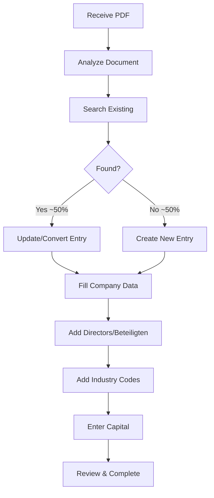

## Neueintragungen (New Registrations)

This section covers the most complex IHK process type: processing **new company registrations** (Anmeldungen/Neueintragungen) from Handelsregister PDFs into the EVA system.

<Note>
**Complexity:** ⭐⭐⭐ High
**Average Time:** 30-45 minutes per entry
**Priority:** Process 2nd (after Löschungen)
</Note>

## Why This Process is Complex

<CardGroup cols={2}>
  <Card title="Search First!" icon="magnifying-glass">
    ~50% already exist as Betriebsstätte or external Hauptsitz
  </Card>
  <Card title="Function Codes" icon="key">
    Critical determination of Code 24 vs 8
  </Card>
  <Card title="Person Matching" icon="user-group">
    Complex name handling rules (German vs Foreign)
  </Card>
  <Card title="Data Validation" icon="circle-check">
    Multiple validation points and dependencies
  </Card>
</CardGroup>

## Standard Process Flow

## Documentation Structure

### [User Manual](/ihk/neueintragungen/user-manual)

Complete step-by-step procedural guide covering:
- Prerequisites and system access
- Daily workflow setup
- 8-phase processing guide (Analyze → Complete)
- Person search and matching
- Function code determination
- Common mistakes to avoid
- Quick reference checklists

### [Edge Cases](/ihk/neueintragungen/edge-cases)

Comprehensive coverage of 80+ edge cases across 14 phases:
- PDF document issues
- Search and identification challenges
- Company name processing complexities
- Address validation scenarios
- Person/director data edge cases
- Legal representation complexities
- And more...

### [Field Mapping](/ihk/neueintragungen/field-mapping)

Complete PDF-to-EVA field mapping reference:
- Section-by-section PDF structure breakdown
- EVA system field definitions
- Processing rules and special cases
- Automation considerations

## Key PDF Sections

When processing a Neueintragung PDF, you'll extract data from these sections:

| Section | Content | EVA Field(s) |
|---------|---------|--------------|
| 1 | Nummer der Eintragung | Reference only |
| 2 | Firma & Sitz | Firmierung, Anschrift |
| 2 | Gegenstand | Branchenschlüssel |
| 3 | Stammkapital | Kapital |
| 4 | Geschäftsführer | Beteiligten |
| 6 | Rechtsform | Entry type determination |
| 7 | Tag der Eintragung | Beginndatum (all fields) |

## Critical Rules

<Warning>
**Must-Know Rules for Neueintragungen:**

1. **Always search first** - ~50% already exist in system
2. **Function codes are critical** - Code 24 vs 8 determines legal signing authority
3. **Name handling varies by residence** - German vs Foreign rules
4. **Alphasort exclusions** - Certain terms cannot be used
5. **Hamburg address rules** - Lowercase suffixes (e.g., "12a")
6. **Tag der Eintragung** - Used throughout as Beginndatum
7. **Sitzverlegung** - Search both old and new company names
</Warning>

## Quick Start

<Steps>
  <Step title="Read Prerequisites">
    Ensure you have system access and understand German commercial register concepts
  </Step>
  <Step title="Follow User Manual">
    Work through the 8-phase process step-by-step
  </Step>
  <Step title="Reference Edge Cases">
    Keep edge cases guide handy for unusual scenarios
  </Step>
  <Step title="Use Field Mapping">
    Refer to field mapping for specific field questions
  </Step>
</Steps>

## Next Steps

<CardGroup cols={2}>
  <Card title="Start Processing" icon="play" href="/ihk/neueintragungen/user-manual">
    Jump into the complete user manual
  </Card>
  <Card title="Handle Edge Cases" icon="triangle-exclamation" href="/ihk/neueintragungen/edge-cases">
    Learn about unusual scenarios
  </Card>
  <Card title="Field Reference" icon="table" href="/ihk/neueintragungen/field-mapping">
    PDF to EVA field mapping guide
  </Card>
  <Card title="Back to Overview" icon="arrow-left" href="/ihk/overview">
    Return to main IHK process overview
  </Card>
</CardGroup>
