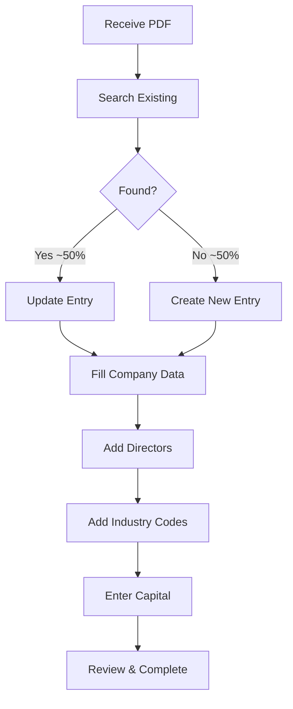

## Introduction

This documentation covers the complete workflow for processing **Handelsregister Neueintragungen** (new company registrations) in the EVA system for the Hamburg Chamber of Commerce (IHK).

<Note>
This process handles approximately **140 entries per day** for Hamburg, with new company registrations being the most time-consuming of the three process types.
</Note>

## What You'll Learn

<CardGroup cols={2}>
  <Card title="Daily Workflow" icon="calendar-days" href="/ihk/user-manual">
    Step-by-step guide for processing entries from PDF to system completion
  </Card>
  <Card title="Edge Cases" icon="triangle-exclamation" href="/ihk/edge-cases">
    Comprehensive coverage of unusual scenarios and troubleshooting
  </Card>
  <Card title="Field Mapping" icon="table" href="/ihk/field-mapping">
    Complete PDF-to-EVA system field mapping reference
  </Card>
  <Card title="Best Practices" icon="check-circle" href="/ihk/user-manual#common-mistakes-to-avoid">
    Common mistakes to avoid and efficiency tips
  </Card>
</CardGroup>

## Quick Start

### Prerequisites
- Access to EVA system
- Access to Handelsregister PDF meldungen
- Understanding of German commercial register concepts
- This documentation

### Process Overview

### Key Statistics

- **~50% already exist** in system - always search first!
- **Function codes (24 vs 8)** determine legal authority - critical to get right
- **Name handling varies** by residence (German vs Foreign rules)
- Process entries **chronologically** - complete one date before moving to next

## Critical Rules

<Warning>
**Always search before creating!** Approximately 50% of Neueintragungen already exist in the system as branches or external headquarters.
</Warning>

<CardGroup cols={3}>
  <Card title="Function Codes" icon="key">
    Code 24 vs 8 determines legal signing authority
  </Card>
  <Card title="Name Handling" icon="user">
    Different rules for German vs Foreign residents
  </Card>
  <Card title="Registration Date" icon="calendar">
    Tag der Eintragung used throughout as Beginndatum
  </Card>
</CardGroup>

## Document Structure

### 1. User Manual
Complete step-by-step procedural guide covering:
- Getting started and daily workflow setup
- Eight-phase processing guide (Analyze → Complete)
- Edge cases and troubleshooting
- Common mistakes and quick reference checklists

[View User Manual →](/ihk/user-manual)

### 2. Edge Cases Reference
Comprehensive coverage of 80+ edge cases across 14 phases:
- PDF document issues
- Search and identification challenges
- Company name processing complexities
- Address validation scenarios
- Person/director data edge cases
- Legal representation complexities
- Compliance and system integration issues

[View Edge Cases →](/ihk/edge-cases)

### 3. Field Mapping Guide
Complete reference for PDF-to-EVA field mapping:
- Section-by-section PDF structure breakdown
- EVA system field definitions
- Processing rules and special cases
- Automation considerations

[View Field Mapping →](/ihk/field-mapping)

## Next Steps

<Steps>
  <Step title="Read the User Manual">
    Start with the [complete user manual](/ihk/user-manual) to understand the full workflow
  </Step>
  <Step title="Reference Edge Cases">
    Keep the [edge cases guide](/ihk/edge-cases) handy for unusual scenarios
  </Step>
  <Step title="Use Field Mapping">
    Reference the [field mapping guide](/ihk/field-mapping) for specific field questions
  </Step>
</Steps>

## Quick Links

- [Daily Workflow Setup](/ihk/user-manual#daily-workflow-setup)
- [Search Process](/ihk/user-manual#phase-2-search-for-existing-entry)
- [Function Code Determination](/ihk/user-manual#phase-5-enter-beteiligten)
- [Common Mistakes](/ihk/user-manual#common-mistakes-to-avoid)
- [Glossary](/ihk/user-manual#appendix-glossary)
