## Introduction

This documentation covers the complete workflow for processing **Handelsregister** (commercial register) entries in the EVA system for the Hamburg Chamber of Commerce (IHK).

<Note>
**Daily Volume:** Approximately **140 entries per day** for Hamburg with a 50/50 ratio of existing vs. new companies.
</Note>

## Three Process Types

The IHK process consists of three distinct types of entries, each with different complexity and processing requirements:

<CardGroup cols={3}>
  <Card title="Neueintragungen" icon="building" color="#16A34A" href="/ihk/neueintragungen/overview">
    **New Registrations**

    Most complex process type for newly registered companies
  </Card>
  <Card title="Veränderungen" icon="pen-to-square" color="#F59E0B" href="/ihk/veraenderungen/overview">
    **Changes**

    Modifications to existing company records
  </Card>
  <Card title="Löschungen" icon="trash" color="#EF4444" href="/ihk/loeschungen/overview">
    **Deletions**

    Fastest process for company closures
  </Card>
</CardGroup>

## Processing Priority

<Warning>
**Process entries chronologically!** Complete one date before moving to the next to avoid missing complementary entries.
</Warning>

**Recommended Daily Order:**

1. **Abmeldungen/Löschungen first** (Deletions) - Fastest, ~10-15 min each
2. **Anmeldungen/Neueintragungen second** (New Registrations) - Most complex, ~30-45 min each
3. **Ummeldungen/Veränderungen last** (Changes) - Medium complexity, ~20-30 min each

## Document Flow

```mermaid
graph LR
    A[Handelsregister] --> B[Handelskammer Hamburg]
    B --> C[PDF Delivery]
    C --> D{Process Type?}
    D -->|New| E[Neueintragungen]
    D -->|Change| F[Veränderungen]
    D -->|Delete| G[Löschungen]
    E --> H[EVA System]
    F --> H
    G --> H
```

## Key Statistics

<CardGroup cols={2}>
  <Card title="Daily Volume" icon="calendar-days">
    ~140 entries/day for Hamburg
  </Card>
  <Card title="Existing vs New" icon="chart-pie">
    50% already exist in system
  </Card>
  <Card title="Search First" icon="magnifying-glass">
    Always search before creating!
  </Card>
  <Card title="Chronological" icon="clock">
    Process day-by-day in order
  </Card>
</CardGroup>

## Process Comparison

| Aspect | Neueintragungen | Veränderungen | Löschungen |
|--------|----------------|---------------|------------|
| **Complexity** | ⭐⭐⭐ High | ⭐⭐ Medium | ⭐ Low |
| **Time** | 30-45 min | 20-30 min | 10-15 min |
| **Priority** | 2nd | 3rd | 1st |
| **Search Required** | Yes (~50% exist) | Yes (100% must exist) | Yes (must find) |
| **New Entry** | Often needed | Rare | Never |

## Common Elements Across All Types

### Universal Rules

<AccordionGroup>
  <Accordion title="Always Search First">
    Before any processing, search the system for existing entries by:
    - Company name (similar search, not exact)
    - Registration number
    - Person names and birth dates
  </Accordion>

  <Accordion title="Chronological Processing">
    Process entries date-by-date to ensure:
    - No missing complementary entries
    - Correct sequencing of changes
    - Complete cross-references
  </Accordion>

  <Accordion title="Function Codes">
    Critical for legal representation:
    - **Code 24:** Alleinvertretungsbefugnis (sole representation)
    - **Code 8:** Joint representation
    - Determines signing authority
  </Accordion>

  <Accordion title="Name Handling">
    Rules vary by residence:
    - **German residents:** First name only in Vorname, others in Schlagwort
    - **Foreign residents:** All names in Vorname field
  </Accordion>
</AccordionGroup>

### System Requirements

- Status must show **"vollständig"** before completion
- Use **"übernehmen"** not "okay" for each step
- Final status change to **"bearbeitet"** assigns Identnummer

## Getting Started

<Steps>
  <Step title="Choose Process Type">
    Identify whether you're processing Neueintragungen, Veränderungen, or Löschungen
  </Step>
  <Step title="Start with Deletions">
    Process Löschungen first as they're fastest and simplest
  </Step>
  <Step title="Process New Registrations">
    Handle Neueintragungen second - most time-consuming
  </Step>
  <Step title="Handle Changes Last">
    Complete Veränderungen last for the day
  </Step>
</Steps>

## Process-Specific Documentation

### 🏢 Neueintragungen (New Registrations)

Complete documentation for processing new company registrations:

- [Overview](/ihk/neueintragungen/overview) - Process introduction
- [User Manual](/ihk/neueintragungen/user-manual) - Step-by-step guide
- [Edge Cases](/ihk/neueintragungen/edge-cases) - 80+ scenarios
- [Field Mapping](/ihk/neueintragungen/field-mapping) - PDF to EVA mapping

[Start with Neueintragungen →](/ihk/neueintragungen/overview)

### ✏️ Veränderungen (Changes)

<Info>
**Documentation in progress**

This section will cover modifications to existing company records.
</Info>

[View Veränderungen →](/ihk/veraenderungen/overview)

### 🗑️ Löschungen (Deletions)

<Info>
**Documentation in progress**

This section will cover company deletion and closure processes.
</Info>

[View Löschungen →](/ihk/loeschungen/overview)

## Quick Reference

### Critical Rules (All Types)

- ⚠️ Always search before creating/updating
- ⚠️ Process chronologically by date
- ⚠️ Function codes determine legal authority
- ⚠️ Name handling varies by residence
- ⚠️ Status must be "vollständig" before completion

### Support Resources

- [Glossary](/ihk/neueintragungen/user-manual#appendix-glossary)
- [Common Mistakes](/ihk/neueintragungen/user-manual#common-mistakes-to-avoid)
- [Search Process](/ihk/neueintragungen/user-manual#phase-2-search-for-existing-entry)
